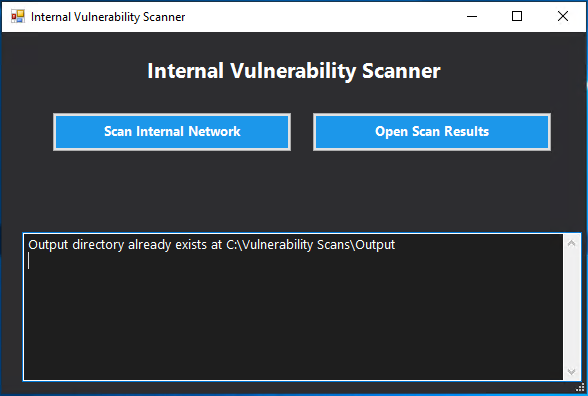

# Internal Vulnerability Scanner

## Description
This PowerShell script creates a graphical user interface (GUI) for scanning internal networks for vulnerabilities using Nmap. The scanner allows you to perform network scans and view the results directly within the application.

## Features
- GUI with a form for easy interaction
- Scan internal network for vulnerabilities using Nmap
- Display scan results within the application
- Save scan results to a specified output directory
- Open and view scan results from the application

## Prerequisites
- Windows operating system
- PowerShell installed
- Nmap installed and added to your system's PATH

## Setup Instructions
1. **Download and Install Nmap:**
   - Download Nmap from [Nmap Downloads](https://nmap.org/download.html).
   - Install Nmap and ensure it is added to your system's PATH.

2. **Place the Script:**
   - Place the `Vulnerability_Scanner.ps1` script in your desired directory.

3. **Ensure the Output Directory Exists:**
   - The script uses `C:\Vulnerability Scans\Output` as the default output directory. Modify this path in the script if necessary.

## Usage Instructions
1. **Open PowerShell with Administrative Privileges:**
   - Right-click on the PowerShell icon and select `Run as administrator`.

2. **Navigate to the Script Directory:**
   ```powershell
   cd path\to\your\script

3. **Run the Script:**
   ```powershell
   .\Vulnerability_Scanner.ps1

4. **Interact with the GUI:**
  Scan Internal Network: Click the "Scan Internal Network" button to start scanning the specified IP range.
  Open Scan Results: Click the "Open Scan Results" button to view the results of the last scan.

## Example Command
.\Vulnerability_Scanner.ps1

## Notes
- Modify the IP range and output file name in the script if necessary.
- Ensure Nmap is properly installed and accessible from the command line.
- The script uses a default IP range of 10.10.1.0/24 for scanning. Adjust this as needed for your network.

## Screenshots



## License

This project is licensed under the MIT License. See the [LICENSE](LICENSE) file for more details.

